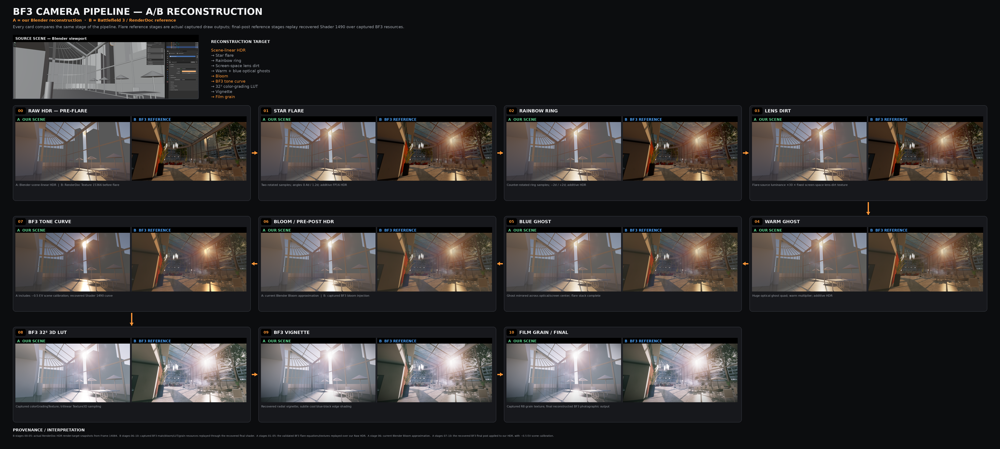
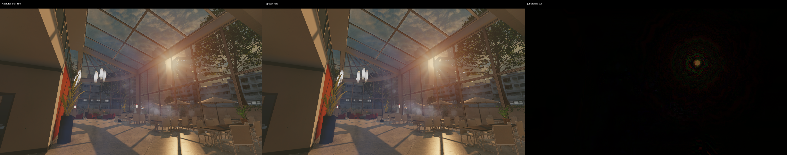
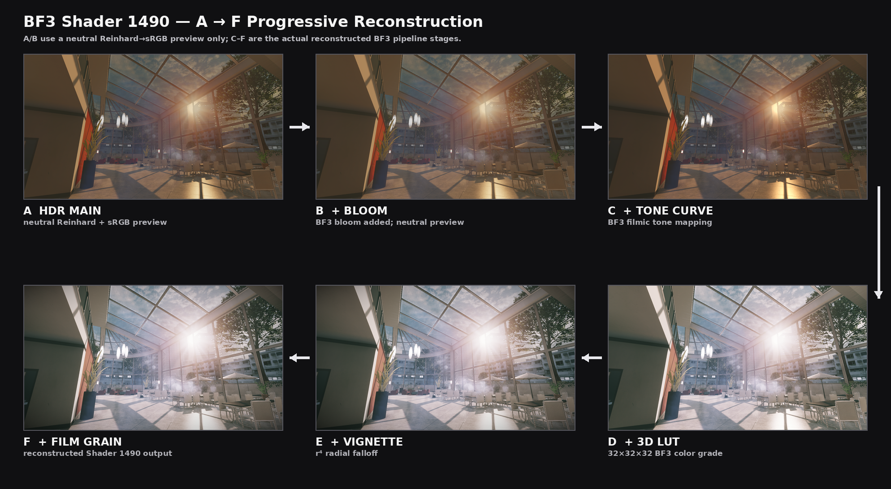
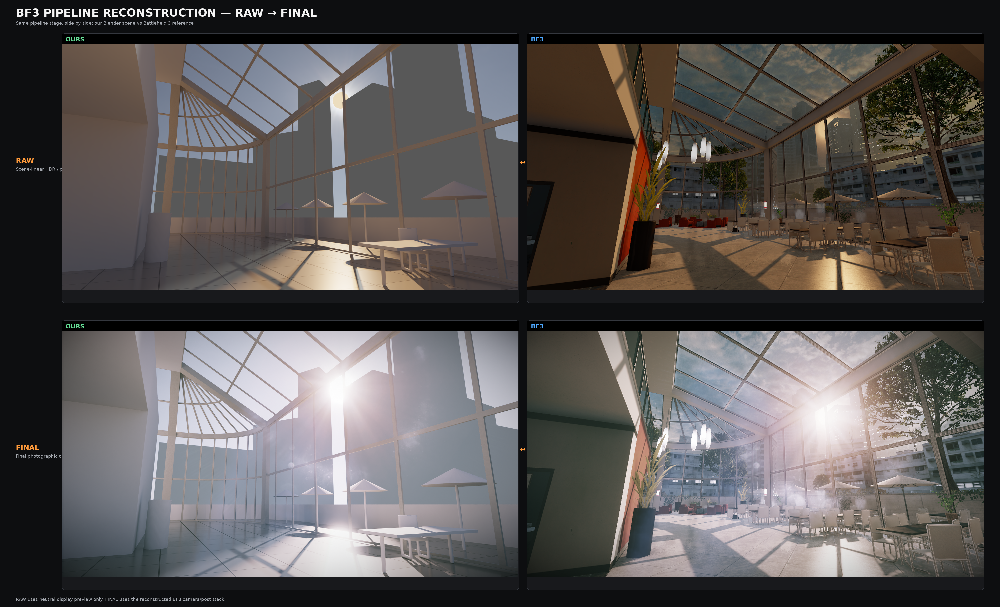
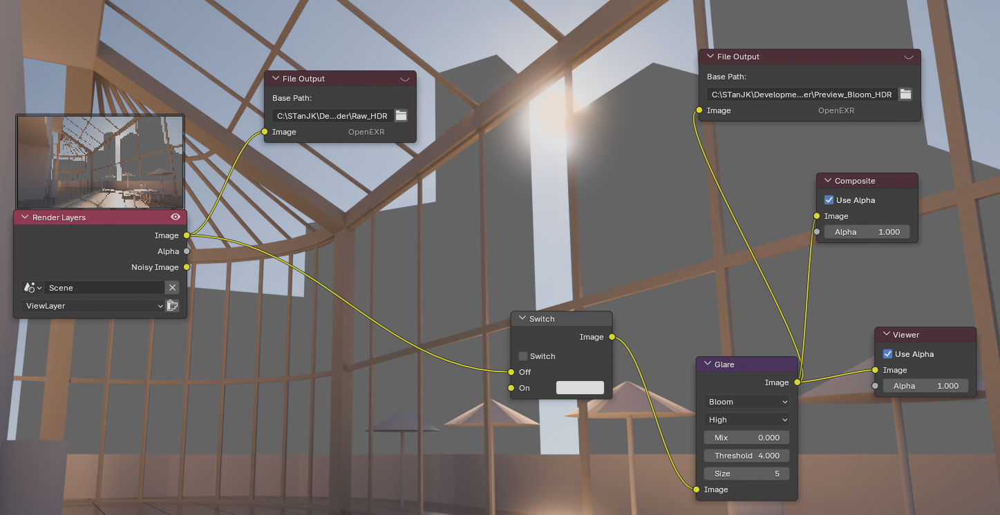

# BF3 Render Stack

Independent research reconstruction of selected parts of the **Battlefield 3 / Frostbite 2 photographic render stack**, derived from GPU-capture observations and reimplemented as original Python, HLSL reference code, and Blender compositor tooling.



The current project reconstructs:

- the five-layer lens-flare / optical-artifact stack;
- the final photographic pass: tone curve, 32³ LUT, vignette, and film grain;
- a Blender-native compositor implementation;
- an offline validation path against captured FP16 HDR buffers.

> **Unofficial research project.** Not affiliated with Electronic Arts or DICE. Battlefield, Frostbite, and related marks are property of their respective owners.

## What is public

This repository contains only project-authored material:

- independently written replay / reconstruction code;
- mathematical descriptions and recovered constants;
- Blender integration;
- validation methodology and measurements;
- research figures used for technical documentation and comparison.

It intentionally does **not** redistribute extracted DICE/Frostbite assets, raw RenderDoc captures, original shader bytecode, verbatim shader disassembly/decompilation, LUTs, grain textures, flare textures, or raw game buffers.

See [THIRD_PARTY_NOTICE.md](THIRD_PARTY_NOTICE.md) and [docs/private-assets.md](docs/private-assets.md).

## Results

### Lens flare

Five additive screen-space flare draws were isolated:

1. star flare;
2. rainbow ring;
3. screen-space lens dirt;
4. warm optical ghost;
5. blue mirrored ghost.

The offline replay was compared with captured HDR render-target snapshots:

```text
HDR MAE  ≈ 0.00030
HDR RMSE ≈ 0.00058
```



### Final photographic pass

The recovered final-pass order is:

```text
scene-linear HDR
  -> flare stack
  -> bloom
  -> exposure / color scale
  -> recovered tone curve
  -> 32^3 3D LUT
  -> vignette
  -> film grain
  -> SDR output
```



A compact raw-vs-final comparison is available here:



## Repository layout

```text
BF3-Render-Stack/
├─ src/
│  ├─ bf3_flare_replay.py
│  ├─ bf3_post.py
│  └─ shader1490_reference.hlsl
├─ blender/
│  └─ build_bf3_flare_nodes.py
├─ examples/
│  └─ post.ps1
├─ docs/
│  ├─ pipeline.md
│  ├─ methodology.md
│  ├─ validation.md
│  ├─ blender-workflow.md
│  ├─ shader1490.md
│  ├─ private-assets.md
│  ├─ private-reference-manifest.json
│  ├─ research-log.md
│  ├─ research-figures.md
│  └─ images/
├─ assets/
│  └─ README.md
├─ requirements.txt
├─ THIRD_PARTY_NOTICE.md
└─ LICENSE
```

## Quick start

### 1. Supply local reference assets

The public repo does **not** contain extracted Battlefield 3 resources. For local experiments, place your own extracted assets under:

```text
private/
├─ flare/
│  ├─ star.png
│  ├─ ring.png
│  ├─ dirty_source.png
│  ├─ lens_dirt.png
│  ├─ warm_ghost.png
│  └─ blue_ghost.png
├─ colorGradingTexture.dds
└─ filmGrainTexture.png
```

`private/` is gitignored.

### 2. Offline flare replay

```powershell
py -m pip install -r requirements.txt
$env:OPENCV_IO_ENABLE_OPENEXR="1"

py .\src\bf3_flare_replay.py `
  .\input.exr `
  -o .\flare.exr `
  --assets-dir .\private\flare `
  --sun-uv 0.70 0.28
```

### 3. Final photographic pass

```powershell
py .\src\bf3_post.py `
  .\flare_plus_bloom.exr `
  --lut .\private\colorGradingTexture.dds `
  --grain .\private\filmGrainTexture.png `
  --exposure-ev -0.5 `
  -o .\final.png
```

The `-0.5 EV` value is a scene calibration used for the current Blender test scene, not a universal BF3 constant.

### 4. Blender compositor integration

Open [blender/build_bf3_flare_nodes.py](blender/build_bf3_flare_nodes.py) in Blender's Scripting workspace and run it.

The script:

- projects an object named `SunCircle` through the active camera;
- rebuilds the five recovered flare layers as native compositor nodes;
- preserves the full-frame HDR domain to avoid finite-sprite seams;
- inserts an A/B switch before the existing Bloom/Glare node;
- leaves the direct Raw HDR output branch untouched.



## Shader-code policy

The public HLSL file is a **clean behavioral reference written for this project**. It is not DICE source code and is not copied from original DXBC/disassembly.

Original DXBC, verbatim RenderDoc shader dumps, and decompiled/disassembled DICE shader text remain private.

See:

- [src/shader1490_reference.hlsl](src/shader1490_reference.hlsl)
- [docs/shader1490.md](docs/shader1490.md)
- [docs/pipeline.md](docs/pipeline.md)

## Research documentation

- [Pipeline reconstruction](docs/pipeline.md)
- [Methodology](docs/methodology.md)
- [Validation](docs/validation.md)
- [Blender workflow](docs/blender-workflow.md)
- [Final-pass notes](docs/shader1490.md)
- [Private/public asset boundary](docs/private-assets.md)
- [Private reference manifest](docs/private-reference-manifest.json)
- [Research log](docs/research-log.md)
- [Figure index](docs/research-figures.md)

## Current status

- [x] final-pass functional reconstruction;
- [x] 32³ LUT trilinear sampling;
- [x] vignette and grain reconstruction;
- [x] five-layer lens-flare reconstruction;
- [x] per-layer HDR validation;
- [x] Blender compositor integration;
- [x] public/private provenance boundary documented;
- [ ] BF3 bloom reconstruction / calibration;
- [ ] stronger sampler-level parity for BC1 textures;
- [ ] generalized camera / occlusion logic;
- [ ] HDR display-output path.

## License

Original project code and documentation are MIT licensed.

Third-party game imagery and marks that may appear inside research figures are **not** covered by the MIT license. See [THIRD_PARTY_NOTICE.md](THIRD_PARTY_NOTICE.md).
