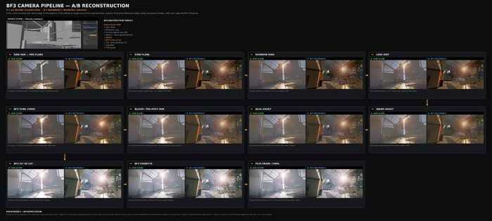
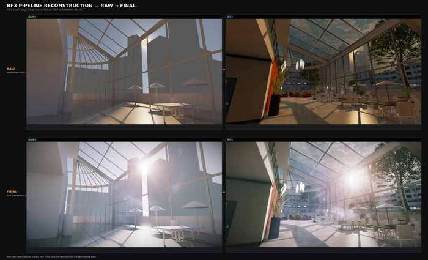
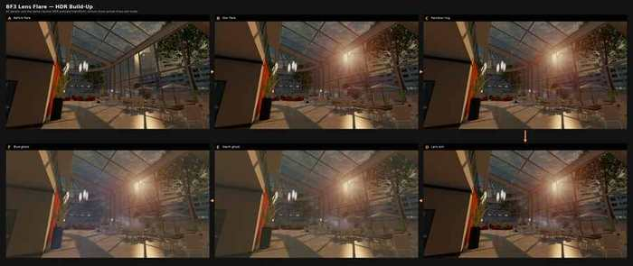
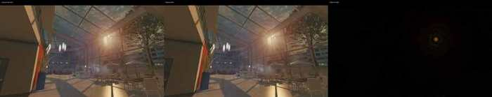
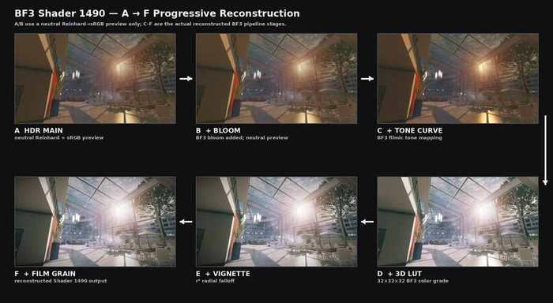
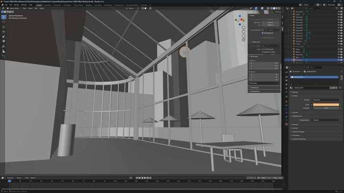
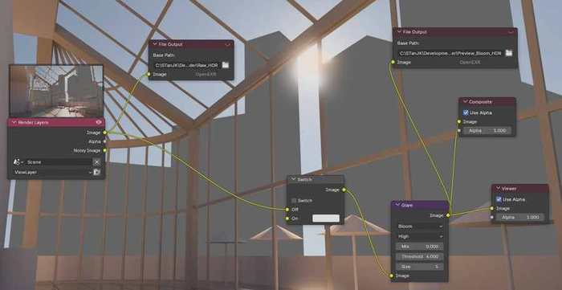
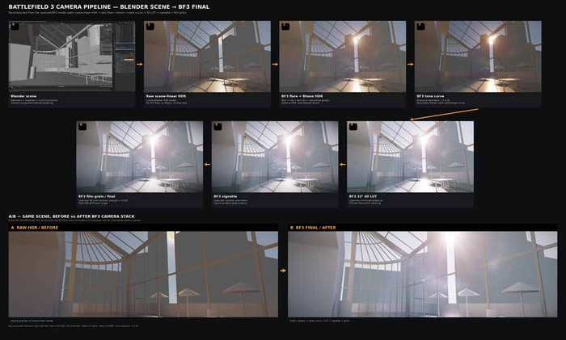

# Research figures

The repository uses a small set of figures to document the reconstruction. The image files live in `docs/images/`.

Some figures contain reduced Battlefield 3 frame excerpts for technical comparison/commentary. Those third-party image portions are not relicensed under MIT.

## Figure index

### Full reconstruction A/B

`full-reconstruction-ab.jpg`

Stage-by-stage comparison between the reconstructed Blender scene and the captured Battlefield 3 reference pipeline.

### Raw vs final

`raw-vs-final.jpg`

Compact comparison of the scene-linear HDR input and final reconstructed photographic output.

### Flare buildup

`flare-buildup.jpg`

Captured HDR buildup across the five isolated lens-flare draws.

### Flare validation

`flare-validation.jpg`

Captured final flare target vs offline replay, plus amplified difference visualization.

### Shader 1490 stages

`shader1490-stages.jpg`

A→F breakdown of the final photographic pass.

### Blender scene

`blender-scene.jpg`

Source scene used for the transfer/reconstruction experiment.

### Blender compositor nodes

`blender-nodes.jpg`

Creator-facing native compositor implementation of the recovered flare stack.

### Blender to final

`blender-to-final.jpg`

End-to-end scene → HDR → reconstructed camera/post pipeline overview.

