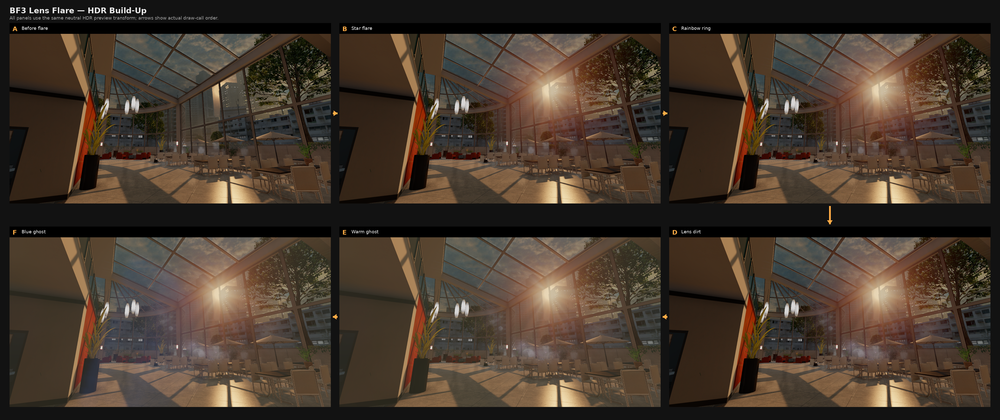
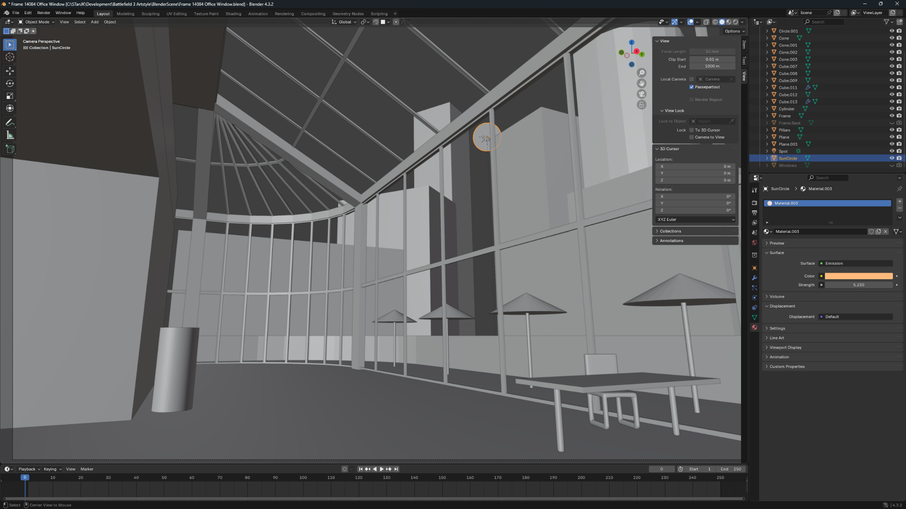
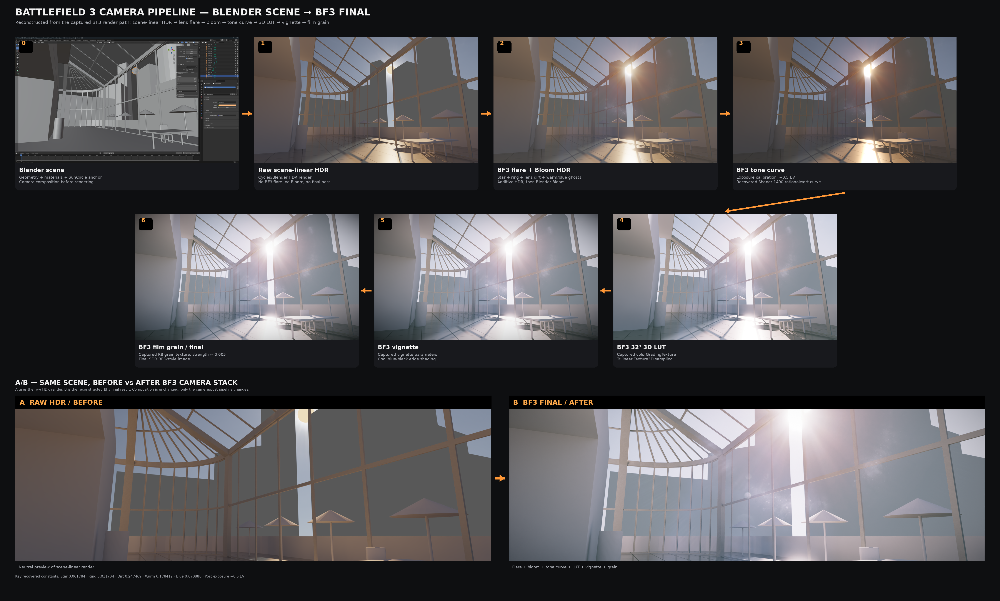

# Research figures

The repository uses the original full-resolution PNG figures in `docs/images/` to document the reconstruction.

Some figures contain Battlefield 3 frame excerpts for technical comparison/commentary. Those third-party image portions are not relicensed under MIT.

## Figure index

### Full reconstruction A/B

`full-reconstruction-ab.png`

Stage-by-stage comparison between the reconstructed Blender scene and the captured Battlefield 3 reference pipeline.

### Raw vs final

`raw-vs-final.png`

Compact comparison of the scene-linear HDR input and final reconstructed photographic output.

### Flare buildup

`flare-buildup.png`

Captured HDR buildup across the five isolated lens-flare draws.

### Flare validation

`flare-validation.png`

Captured final flare target vs offline replay, plus amplified difference visualization.

### Shader 1490 stages

`shader1490-stages.png`

A→F breakdown of the final photographic pass.

### Blender scene

`blender-scene.png`

Source scene used for the transfer/reconstruction experiment.

### Blender compositor nodes

`blender-nodes.png`

Creator-facing native compositor implementation of the recovered flare stack.

### Blender to final

`blender-to-final.png`

End-to-end scene → HDR → reconstructed camera/post pipeline overview.

